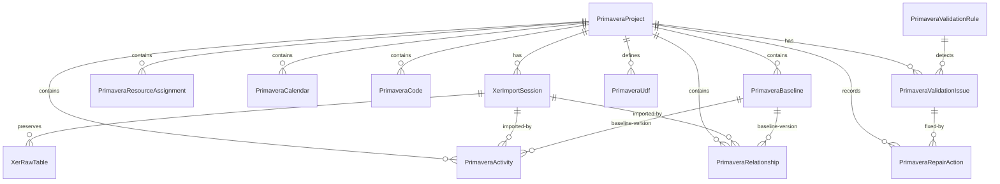

# Data Model: Primavera Studio

**Branch**: `011-primavera-studio` | **Date**: 2026-06-12 | **Plan**: [plan.md](plan.md)

## Overview

Primavera Studio entities are defined in the `Planova.Primavera.Domain.Entities` namespace and persisted via EF Core configurations in `Planova.Persistence.EntityConfigurations`.

## Entity Catalog

### PrimaveraProject
Imported project metadata from an XER file.

| Field | Type | Description |
|-------|------|-------------|
| Id | int (PK) | Auto-generated |
| ProjectId | string | Original project ID from XER |
| Name | string | Project name from XER |
| SourceFileName | string | Original XER filename |
| ImportedAt | DateTime | Import timestamp |
| IsActive | bool | Whether this is the active project |
| ImportSessionId | int (FK) | Reference to the import session |

### XerImportSession
A staged import transaction.

| Field | Type | Description |
|-------|------|-------------|
| Id | int (PK) | Auto-generated |
| Status | enum | Previewing, Committed, Failed, RolledBack |
| SourceFileName | string | Original XER file path |
| SourceFileHash | string | SHA-256 hash for deduplication |
| ImportedAt | DateTime | Import timestamp |
| ImportedBy | string | User identity |
| RowCounts | JSON | Per-entity-type row counts |
| ValidationSummary | JSON | Validation issues summary |
| ErrorMessage | string | Failure reason if applicable |

### XerExportProfile
Export preferences for workspace-to-XER generation.

| Field | Type | Description |
|-------|------|-------------|
| Id | int (PK) | Auto-generated |
| Name | string | Profile name |
| IncludeRawTables | bool | Whether to preserve raw tables |
| SelectedEntityTypes | JSON | Entity types to include |
| OutputPathTemplate | string | Template for output file path |
| CreatedAt | DateTime | Creation timestamp |

### XerRawTable
Raw staging data for unsupported XER table types.

| Field | Type | Description |
|-------|------|-------------|
| Id | int (PK) | Auto-generated |
| ImportSessionId | int (FK) | Parent import session |
| TableName | string | Original XER table name |
| ColumnHeaders | JSON | Ordered list of column names |
| Rows | JSON | Serialized row data (list of dictionaries) |
| SortOrder | int | Original position in XER file |

### PrimaveraActivity
A schedule activity from the XER TASK table.

| Field | Type | Description |
|-------|------|-------------|
| Id | int (PK) | Auto-generated |
| ProjectId | int (FK) | Parent project |
| TaskId | string | XER task_id (for matching on re-import) |
| WbsId | string | WBS code |
| Name | string | Activity name |
| Status | string | Activity status (e.g., Not Started, In Progress, Completed) |
| StartDate | DateTime? | Planned/actual start |
| EndDate | DateTime? | Planned/actual finish |
| Duration | double | Original duration in hours |
| RemainingDuration | double | Remaining duration |
| PercentComplete | double | Progress percentage |
| CalendarId | string? | Reference to PrimaveraCalendar |
| BaselineId | int? (FK) | If part of a baseline |
| BaselineVersion | int? | Version number within baseline |
| ImportSessionId | int (FK) | Source import |
| SourceType | enum | PrimaveraImport, ManualEdit, Repair, Export |
| CreatedAt | DateTime | Record creation timestamp |
| UdfValues | JSON | User-defined field values |

### PrimaveraRelationship
A logical link between two activities.

| Field | Type | Description |
|-------|------|-------------|
| Id | int (PK) | Auto-generated |
| ProjectId | int (FK) | Parent project |
| PredTaskId | string | XER predecessor task_id |
| SuccTaskId | string | XER successor task_id |
| Type | enum | FS, SS, FF, SF |
| LagDuration | double | Lag in hours |
| BaselineId | int? (FK) | If part of a baseline |
| ImportSessionId | int (FK) | Source import |

### PrimaveraResourceAssignment
Resource allocation to an activity.

| Field | Type | Description |
|-------|------|-------------|
| Id | int (PK) | Auto-generated |
| ProjectId | int (FK) | Parent project |
| TaskId | string | XER activity task_id |
| ResourceId | string | XER resource ID |
| Units | double | Allocation units |
| PlannedUnits | double | Budgeted units |
| ActualUnits | double | Actual units used |
| CostPerUnit | decimal | Rate |
| BaselineId | int? (FK) | If part of a baseline |
| ImportSessionId | int (FK) | Source import |

### PrimaveraCalendar
A work/non-work calendar definition.

| Field | Type | Description |
|-------|------|-------------|
| Id | int (PK) | Auto-generated |
| ProjectId | int (FK) | Parent project |
| CalendarId | string | XER calendar_id (for matching on re-import) |
| Name | string | Calendar name |
| IsBaseCalendar | bool | Whether this is a base or derived calendar |
| BaseCalendarId | string? | If derived, reference to base calendar |
| WorkWeek | JSON | Standard work week definition |
| Exceptions | JSON | Calendar exception dates |
| BaselineId | int? (FK) | If part of a baseline |
| ImportSessionId | int (FK) | Source import |

### PrimaveraCode
A code type with values for categorization.

| Field | Type | Description |
|-------|------|-------------|
| Id | int (PK) | Auto-generated |
| ProjectId | int (FK) | Parent project |
| CodeType | enum | ActivityCode, ProjectCode, ResourceCode |
| CodeTypeId | string | XER code type identifier |
| CodeValue | string | Individual code value |
| CodeName | string | Display name for the code |
| ParentCodeId | string? | Hierarchical parent |
| ImportSessionId | int (FK) | Source import |

### PrimaveraBaseline
A frozen schedule snapshot.

| Field | Type | Description |
|-------|------|-------------|
| Id | int (PK) | Auto-generated |
| ProjectId | int (FK) | Parent project |
| BaselineId | string | XER baseline identifier |
| Name | string | Baseline name |
| VersionNumber | int | Version for this baseline |
| IsActive | bool | Whether this is the current baseline |
| CreatedAt | DateTime | Snapshot timestamp |
| ImportSessionId | int (FK) | Source import |

### PrimaveraUdf
User-defined field definition.

| Field | Type | Description |
|-------|------|-------------|
| Id | int (PK) | Auto-generated |
| ProjectId | int (FK) | Parent project |
| UdfTypeId | string | XER UDF type identifier |
| TableName | string | Entity type this UDF applies to (TASK, etc.) |
| FieldName | string | UDF field name |
| FieldType | string | Data type (Text, Number, Date, etc.) |
| ImportSessionId | int (FK) | Source import |

### PrimaveraValidationRule
A registered validation rule.

| Field | Type | Description |
|-------|------|-------------|
| Id | int (PK) | Auto-generated |
| Name | string | Rule name |
| Description | string | Description of what the rule checks |
| Severity | enum | Error, Warning, Info |
| IsEnabled | bool | Whether the rule is active |
| Category | string | Grouping category (Reference, Calendar, Logic, etc.) |

### PrimaveraValidationIssue
A detected validation issue.

| Field | Type | Description |
|-------|------|-------------|
| Id | int (PK) | Auto-generated |
| ProjectId | int (FK) | Parent project |
| RuleId | int (FK) | The rule that detected this issue |
| Severity | enum | Error, Warning, Info |
| EntityType | enum | Which entity type has the issue |
| EntityId | int | The specific entity record |
| Description | string | Human-readable issue description |
| SuggestedFix | string? | Proposed resolution |
| IsResolved | bool | Whether the issue has been addressed |
| DetectedAt | DateTime | When the issue was detected |
| ImportSessionId | int? (FK) | Source import if detected during import |

### PrimaveraRepairAction
A repair operation applied to fix an issue.

| Field | Type | Description |
|-------|------|-------------|
| Id | int (PK) | Auto-generated |
| ProjectId | int (FK) | Parent project |
| IssueId | int (FK) | The issue being fixed |
| Description | string | What was done |
| TargetEntityType | enum | Entity type modified |
| TargetEntityIds | JSON | List of entity IDs modified |
| AppliedBy | string | User identity |
| AppliedAt | DateTime | When the fix was applied |
| UndoAvailable | bool | Whether the fix can be reversed |

## Entity Relationships

## Identity Rules

- All entities use auto-generated integer primary keys (Id).
- XER internal IDs (task_id, calendar_id, etc.) are stored as string fields for matching on re-import (merge behavior).
- Baseline entities are keyed by (BaselineId, BaselineVersionNumber) for clean EF Core relationships.
- Import sessions are uniquely identified by (SourceFileHash, ImportedAt) for deduplication.

## State Transitions

### XerImportSession
Previewing → Committed (user confirms) | Failed (validation error) | RolledBack (mid-import failure)

### PrimaveraValidationIssue
Open → Resolved (auto-resolved by repair) → Closed (user dismisses)

### PrimaveraRepairAction
Proposed → Applied | Rejected (user decision)
